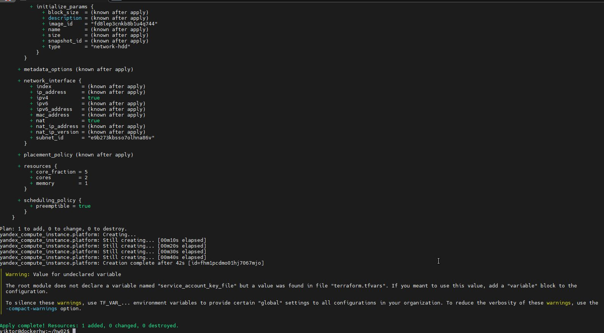
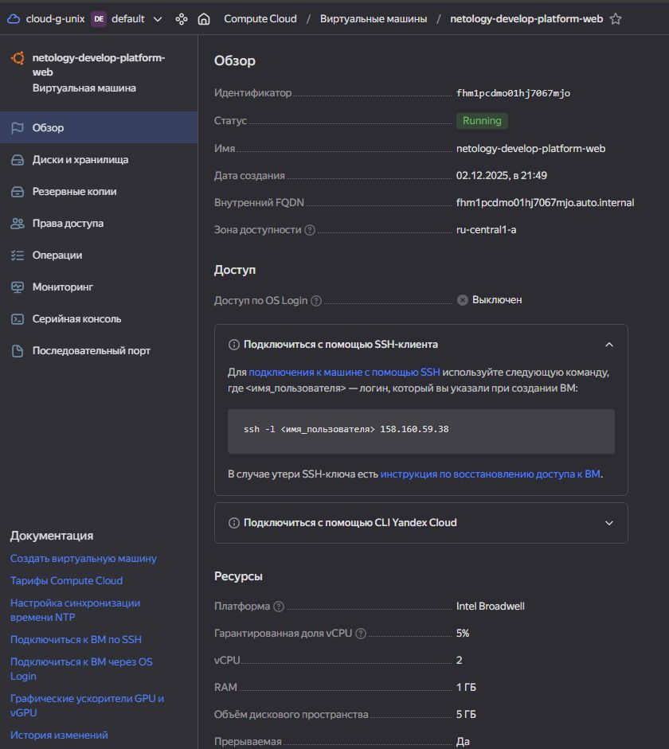
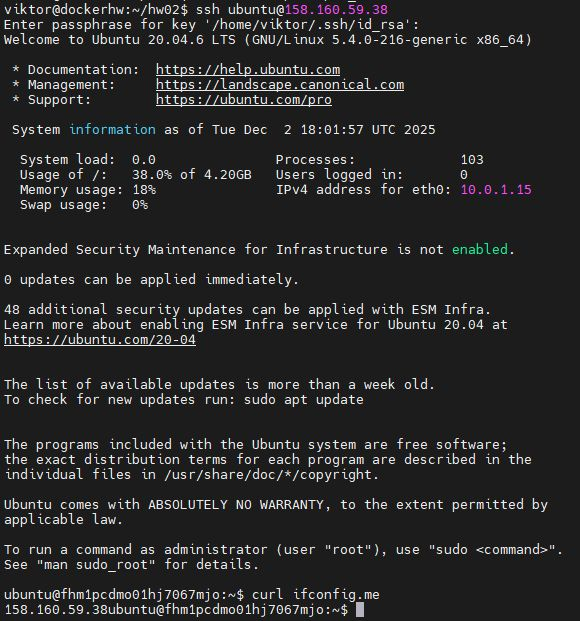

# Домашнее задание к занятию «Основы Terraform. Yandex Cloud» - Лебедев В.В. FOPS-33

### Цели задания

1. Создать свои ресурсы в облаке Yandex Cloud с помощью Terraform.
2. Освоить работу с переменными Terraform.


### Чек-лист готовности к домашнему заданию

1. Зарегистрирован аккаунт в Yandex Cloud. Использован промокод на грант.
2. Установлен инструмент Yandex CLI.
3. Исходный код для выполнения задания расположен в директории [**02/src**](https://github.com/netology-code/ter-homeworks/tree/main/02/src).


### Внимание!! Обязательно предоставляем на проверку получившийся код в виде ссылки на ваш github-репозиторий!
------

### Задание 1
В качестве ответа всегда полностью прикладывайте ваш terraform-код в git.
Убедитесь что ваша версия **Terraform** ~>1.12.0

1. Изучите проект. В файле variables.tf объявлены переменные для Yandex provider.
2. Создайте сервисный аккаунт и ключ. [service_account_key_file](https://terraform-provider.yandexcloud.net).
4. Сгенерируйте новый или используйте свой текущий ssh-ключ. Запишите его открытую(public) часть в переменную **vms_ssh_public_root_key**.
5. Инициализируйте проект, выполните код. Исправьте намеренно допущенные синтаксические ошибки. Ищите внимательно, посимвольно. Ответьте, в чём заключается их суть.
6. Подключитесь к консоли ВМ через ssh и выполните команду ``` curl ifconfig.me```.
Примечание: К OS ubuntu "out of a box, те из коробки" необходимо подключаться под пользователем ubuntu: ```"ssh ubuntu@vm_ip_address"```. Предварительно убедитесь, что ваш ключ добавлен в ssh-агент: ```eval $(ssh-agent) && ssh-add``` Вы познакомитесь с тем как при создании ВМ создать своего пользователя в блоке metadata в следующей лекции.;
8. Ответьте, как в процессе обучения могут пригодиться параметры ```preemptible = true``` и ```core_fraction=5``` в параметрах ВМ.

В качестве решения приложите:

- скриншот ЛК Yandex Cloud с созданной ВМ, где видно внешний ip-адрес;
- скриншот консоли, curl должен отобразить тот же внешний ip-адрес;
- ответы на вопросы.

### Решение 1

Первая ошибка с которой я столкнулся является выбором платформы для виртуальной машины. В файле main.tf, platform_id = "standart-v4" - данной платформы не существует в YC, о чем свидетельствует ошибка ниже. Поэтому данную ошибку исправил на platform_id = "standard-v1"

Вторая ошибка с которой я столкнулся заключается в неверном указании количестве ядер, о чем свидетельствует ошибка ниже. В данной платформе что я выбрал выше, допустимое колчество ядер min=2, max=32. В файле main.tf параметр cores = 1, меняем данное значение на cores = 2

После исправления ошибок машина была создана


Произвел подключение по ssh и выполнил команду curl ifconfig.me

Параметр preemptible = true (прерываемость) позволяет сэкономить деньги при аренде виртуальных мощностей за счет того, что виртуальная машина после 24 часов работы будет остановлена. (может быть также остановлена, если провайдеру экстренно потребуются мощности). 

Параметр core_fraction=5 позволяет задать максимальную загрузку виртуальных ядер. Понижая этот параметр можно также сэкономить деньги при аренде виртуальных мощностей.


### Задание 2

1. Замените все хардкод-**значения** для ресурсов **yandex_compute_image** и **yandex_compute_instance** на **отдельные** переменные. К названиям переменных ВМ добавьте в начало префикс **vm_web_** .  Пример: **vm_web_name**.
2. Объявите нужные переменные в файле variables.tf, обязательно указывайте тип переменной. Заполните их **default** прежними значениями из main.tf. 
3. Проверьте terraform plan. Изменений быть не должно. 

### Решение 2

```
###cloud vars


variable "cloud_id" {
  type        = string
  default     = "b1gd0ene28ce38jum5ol"
  description = "https://cloud.yandex.ru/docs/resource-manager/operations/cloud/get-id"
}

variable "folder_id" {
  type        = string
  default     = "b1gh84ji5m46hok29kbf"
  description = "https://cloud.yandex.ru/docs/resource-manager/operations/folder/get-id"
}

variable "default_zone" {
  type        = string
  default     = "ru-central1-a"
  description = "https://cloud.yandex.ru/docs/overview/concepts/geo-scope"
}
variable "default_cidr" {
  type        = list(string)
  default     = ["10.0.1.0/24"]
  description = "https://cloud.yandex.ru/docs/vpc/operations/subnet-create"
}

variable "vpc_name" {
  type        = string
  default     = "develop"
  description = "VPC network & subnet name"
}

### Ex.2 vars

variable "family_name" {
  type        = string
  default     = "ubuntu-2004-lts"
  description = "Семейство устанавливаемой ОС"
}

variable "vm_web_name" {
  type        = string
  default     = "netology-develop-platform-web"
  description = "Имя виртуальной машины"
}

variable "vm_web_platform_id" {
  type = string
  default = "standard-v1"
  description = "ID виртуальной платформы"
}

variable "vm_web_hw_cores" {
  type = number
  default = 2
  description = "Количество виртуальных ядер"
}
variable "vm_web_hw_memory" {
  type = number
  default = 1
  description = "Объем оперативной памяти"
}

variable "vm_web_core_frac" {
  type = number
  default = 20
  description = "Ограничение пиковой производительности CPU"
}

variable "vm_web_hw_preemptible" {
  type = bool
  default = true
  description = "Прерываемость работы ВМ"
}
variable "vm_web_hw_nat" {
  type = bool
  default = true
  description = "Активировать NAT"
}
variable "vm_web_hw_serial_port_enable" {
  type = number
  default = 1
  description = "Активировать серийный порт для удаленного доступа"
}

# SSH variables
variable "vms_ssh_root_key" {
  type        = string
  description = "ssh-keygen -t ed25519 or rsa"
  default     = "ssh-rsa AAAAB3NzaC1yc2EAAAADAQABAAABAQCvcG8Vf7p3y2uZoqeWojRC6QEsW25sJ7qTk+078OUKWzxOKHok5jmD7t/fZ8A82D6H5dlSHwN0e8SEnWqSuCxBn5vNfljaGNl2gg8rN4n5f9pZYOmi6naEvH3tkX19fSjJY3Yh9WFvjZ5lR+lkCryDxqDxLkH0tawxqumhQpyEnhVd1ljU17+ArZfTrx0Mg3j7J9EhGVaoan3MMuN1mGdA2aBUeDKC85Sh7oE35JuoRuRiFUalCwG4xEB0KjvMJFs3L2yAm2bPBRfkooxiHGEIKOxNvbeFdhixtcHTKg4L1k9lnE5MMix25Trod2xnOLnRIve0tQ62jHeUtzdsBKut viktor-rsa-key-20250120"
}

```

Изменений нет


### Задание 3

1. Создайте в корне проекта файл 'vms_platform.tf' . Перенесите в него все переменные первой ВМ.
2. Скопируйте блок ресурса и создайте с его помощью вторую ВМ в файле main.tf: **"netology-develop-platform-db"** ,  ```cores  = 2, memory = 2, core_fraction = 20```. Объявите её переменные с префиксом **vm_db_** в том же файле ('vms_platform.tf').  ВМ должна работать в зоне "ru-central1-b"
3. Примените изменения.

### Решение 3

### Задание 4

1. Объявите в файле outputs.tf **один** output , содержащий: instance_name, external_ip, fqdn для каждой из ВМ в удобном лично для вас формате.(без хардкода!!!)
2. Примените изменения.

В качестве решения приложите вывод значений ip-адресов команды ```terraform output```.

### Решение 4

### Задание 5

1. В файле locals.tf опишите в **одном** local-блоке имя каждой ВМ, используйте интерполяцию ${..} с НЕСКОЛЬКИМИ переменными по примеру из лекции.
2. Замените переменные внутри ресурса ВМ на созданные вами local-переменные.
3. Примените изменения.

### Решение 5

### Задание 6

1. Вместо использования трёх переменных  ".._cores",".._memory",".._core_fraction" в блоке  resources {...}, объедините их в единую map-переменную **vms_resources** и  внутри неё конфиги обеих ВМ в виде вложенного map(object).  
   ```
   пример из terraform.tfvars:
   vms_resources = {
     web={
       cores=2
       memory=2
       core_fraction=5
       hdd_size=10
       hdd_type="network-hdd"
       ...
     },
     db= {
       cores=2
       memory=4
       core_fraction=20
       hdd_size=10
       hdd_type="network-ssd"
       ...
     }
   }
   ```
3. Создайте и используйте отдельную map(object) переменную для блока metadata, она должна быть общая для всех ваших ВМ.
   ```
   пример из terraform.tfvars:
   metadata = {
     serial-port-enable = 1
     ssh-keys           = "ubuntu:ssh-ed25519 AAAAC..."
   }
   ```  
  
5. Найдите и закоментируйте все, более не используемые переменные проекта.
6. Проверьте terraform plan. Изменений быть не должно.

------

### Решение 6

### Правила приёма работыДля подключения предварительно через ssh измените пароль пользователя: sudo passwd ubuntu
В качестве результата прикрепите ссылку на MD файл с описанием выполненой работы в вашем репозитории. Так же в репозитории должен присутсвовать ваш финальный код проекта.

**Важно. Удалите все созданные ресурсы**.


### Критерии оценки

Зачёт ставится, если:

* выполнены все задания,
* ответы даны в развёрнутой форме,
* приложены соответствующие скриншоты и файлы проекта,
* в выполненных заданиях нет противоречий и нарушения логики.

На доработку работу отправят, если:

* задание выполнено частично или не выполнено вообще,
* в логике выполнения заданий есть противоречия и существенные недостатки. 
